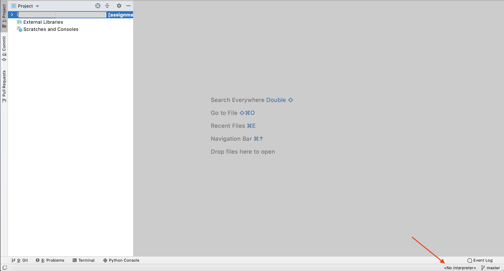
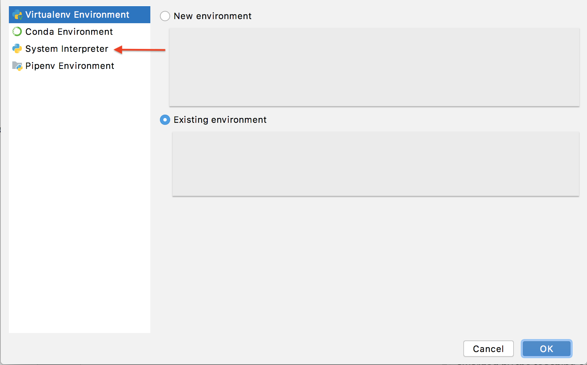

## Assignment 2 - Calculator and Text Analyzer

### BACKGROUND

This assignment will explore many of the topics that have recently been covered. This includes variables, expressions, operators, input/output, data types, functions, and loops. In this programming assignment, you will put those pieces together in order to build two programs:

1. a simple arithmetic calculator
1. a simple text analyzer

Clone this repository through PyCharm to complete the programs on your local computer. Recall the steps in this process (these insturctions will be left out of future assignments):

**1.** When you first open **PyCharm**, you will be prompted to make a choice to get started. Select **Get from Version Control**.

**2.** Select GitHub from the options in the left panel under **Repository URL**. 

**3.** Select your repository (assignment2-\<username>) from the list, then click clone. 
    
**4.** You will need to re-enter your GitHub credentials. Enter the credentials and click the **Log In** button. Your repository will then open inside of PyCharm. 

**5.** In order to run your code, you will need to configure your Python interpreter. In the bottom right-corner of the PyCharm window, you will see **\<No interpreter>**. Click on **\<No interpreter>**. Then click on **Add Interpreter...**. You may need to authorize access to your files from PyCharm.



**6.** In the **Add Python Interpreter** window, click on **System Interpreter** in the left panel.  



If the listed **Interpreter** does not include **Python38-32** (for Windows) or **python3.8** (for Mac OS), change the **Interpreter** selection to one that does. Your options will be slightly different if you are using a different version of Python (such as Python 3.9).

**7.** Click the **OK** button.

**NOTE**: Some concepts used in this assignment will be covered over the next few lectures. If you are someone who wants to get an early start (a good thing), you are encouraged to complete the reading assignments ahead of time for these topics.

Let's get started.

## TABLE OF CONTENTS
1. [Step 0 - Read the README](#step0)
1. [Decomposition](#decomposition)
1. [Instructions (Calculator)](#instructions_c)
    1. [Step 1 - Displaying calculator options](#step1_c)
    1. [Step 2 - Performing calculator operations](#step2_c)
    1. [Step 3 - Processing the user's calculator choice](#step3_c)
    1. [Step 4 - Running the Calculator](#step4_c)
1. [Instructions (Text Analyzer)](#instructions_ta)
    1. [Step 1 - Identifying character types](##step4_ta)
    1. [Step 2 - Outputting the results](#step2_ta)
    1. [Step 3 - Analyzing user's text](#step3_ta)
    1. [Step 4 - Running the Text Analyzer](#step4_ta)
1. [Evaluation](#eval)
1. [Assignment Submission](#submit)

<a name="step0"></a>
### STEP 0 - READ THE README

Before writing a single line of Python code for this assignment, you are **strongly** encouraged to read this document in its entirety. The document includes key details about the expected implementation of your program. Diving into the implementation based soley on the description of the program above is likely to result in following a path towards your program's implementation that fails to meet the requirements of this assignment.

If you would like to consume this document in an alternative format, the README has also been converted to a PDF which is available in this repository.

<a name="decomposition"></a>
### DECOMPOSITION
We will continue to utilize our functional decomposition strategy in the implementation of these programs. For this assignment, most of the decomposition has been done for you. However, you are always welcome to further decompose your programs as you see fit.

The structure of this document breaks down the assignment into a series of steps that if followed closely will lead to an implementation that meets the requirements for the assignment. The steps also correspond to groups of tests that can be used to pursue an incremental development approach to writing your programs. Start with **Step 1**, implement the function as described for that step, and submit your (unfinished) code to Gradescope. You are able to submit your assignment to Gradescope as many times as you want without any penalties. Your assignment will likely fail the non-**Step 1** tests. However, when implemented to meet the requirements in this README, the **Step 1** tests should pass. If the tests do not pass, try to alter your code to get the tests to pass before moving on to **Step 2**. Ask for help of the course staff if you are having trouble getting the tests to pass. Once the **Step 1** tests pass, proceed to Step 2 and repeat this process. This incremental approach to implementing your programs is an approach that is less likely to lead to bugs in your code and is being emphasized as a key learning goal for this course.

<a name="instructions_c"></a>
### INSTRUCTIONS (Calculator)

**Restrictions: No Python container datatypes (`dict`, `list`, `set`, `tuple`, etc) can be used in this program**

When your Calculator program is run, the following message should be displayed to the user of the program:

```out
Welcome to the CS 1114 Calculator!

1) Perform addition
2) Perform subtraction
3) Perform multiplication
4) Perform division
Please enter an option (1-4) or 'q' to quit:
```

The last line output is a prompt for input from the user. Valid input from the user is an integer between `1` and `4` or the letter `q`.
In the case that the user wants to calculate the sum of two numbers (e.g. `3.6` and `4.5`), the user will enter `1` when prompted for an option. The choice will be acknowledged and the user will be prompted to enter the first number (`3.6`). Next, the user will be prompted to enter the second number (`4.5`). The user will then be shown the sum of the two numbers (`8.1`, in this case). In the situation described, the output from the program from the point where the input of the calculator option is provided until the display of the resulting sum will be:
 
```out 
Please enter an option (1-4) or 'q' to quit: 1

You have chosen the addition operation.
Enter first number: 3.6
Enter second number: 4.5
The sum is 8.1.
```

In the case that the user wants to calculate the difference between two numbers (e.g. `10.8` and `17.2`), the user will enter `2` when prompted for an option. The choice will be acknowledged and the user will then be prompted to enter the first number (`10.8`). Next, the user will be prompted to enter the second number (`17.2`). The user will then be shown the difference between the two numbers (`-6.4`, in this case). In the situation described, the output from the program from the point where the input of the calculator option is provided until the display of the difference between the two numbers will be:

```out 
Please enter an option (1-4) or 'q' to quit: 2

You have chosen the subtraction operation.
Enter first number: 10.8
Enter second number: 17.2
The difference is -6.4.
```
In the case that the user wants to calculate the product of two numbers (e.g. `7.3` and `10.1`), the user will enter `3` when prompted for an option. The choice will be acknowledged and the user will then be prompted to enter the first number (`7.3`). Next, the user will be prompted to enter the second number (`10.1`). The user will then be shown the product of the two numbers (`73.73`, in this case). In the situation described, the output from the program from the point where the input of the calculator option is provided until the display of the product of the two numbers will be:

```out 
Please enter an option (1-4) or 'q' to quit: 3

You have chosen the multiplication operation.
Enter first number: 7.3
Enter second number: 10.1
The product is 73.73.
```

In the case that the user wants to calculate the result of dividing the first number entered (`17`) by a second number entered (`20`), the user will enter `4` when prompted for an option. The choice will be acknowledged and the user will then be prompted to enter the first number (`17`). Next, the user will be prompted to enter the second number (`20`). The user will then be shown the result of the division (`0.85`, in this case). In the situation described, the output from the program from the point where the input of the calculator option is provided until the display of the division operation will be:

```out
Please enter an option (1-4) or 'q' to quit: 4

You have chosen the division operation.
Enter first number: 17
Enter second number: 20
The result of the division of the two numbers is 0.85.
```

The program will display the menu of options again after any of the operations above are performed. If a user inputs any value other than `1`, `2`, `3`, `4` or `q` when prompted, the program will output

```out 
That was not a valid choice. Try again.
```

For example, if the user entered `5` when prompted for an option, the program will display:

```
Please enter an option (1-4) or 'q' to quit: 5

That was not a valid choice. Try again.

1) Perform addition
2) Perform subtraction
3) Perform multiplication
4) Perform division
Please enter an option (1-4) or 'q' to quit:
```

In addition, calculations can be performed more than once while the program is running. The previous calculations can be performed in a single session of the program. To stop the program from continuously executing, the user will enter `q`. When the user enters the `q` option at the prompt, the program will end and `Goodbye.` will be displayed to the user:

```out 
Welcome to the CS 1114 Calculator!

1) Perform addition
2) Perform subtraction
3) Perform multiplication
4) Perform division
Please enter an option (1-4) or ’q’ to quit: 1

You have chosen the addition operation.
Enter first number: 3.6
Enter second number: 4.5
The sum is 8.1.

1) Perform addition
2) Perform subtraction
3) Perform multiplication
4) Perform division
Please enter an option (1-4) or ’q’ to quit: 2

You have chosen the subtraction operation.
Enter first number: 10.8
Enter second number: 17.2
The difference is -6.4.

1) Perform addition
2) Perform subtraction
3) Perform multiplication
4) Perform division
Please enter an option (1-4) or ’q’ to quit: 3

You have chosen the multiplication operation.
Enter first number: 7.3
Enter second number: 10.1
The product is 73.73.

1) Perform addition
2) Perform subtraction
3) Perform multiplication
4) Perform division
Please enter an option (1-4) or ’q’ to quit: 4

You have chosen the division operation.
Enter first number: 17
Enter second number: 20
The result of the division of the two numbers is 0.85.

1) Perform addition
2) Perform subtraction
3) Perform multiplication
4) Perform division
Please enter an option (1-4) or ’q’ to quit: q
 
Goodbye.
```

<a name="step1_c"></a>
#### Step 1 - Displaying calculator options

Function: `print_menu()`

```python
def print_menu():
    """Prints a welcome message and available calculator
    operations.

    :return: None

    >>> print_menu()
    <BLANKLINE>
    1) Perform addition
    2) Perform subtraction
    3) Perform multiplication
    4) Perform division
    """
```

Start by defining the `print_menu()` function to output the menu of calculator options as described above. This function includes **one blank line** before the options are displayed. The options should be output as a numbered list exactly as displayed below:

```out 

1) Perform addition
2) Perform subtraction
3) Perform multiplication
4) Perform division
```

A **doctest** is included in the function comments (aka docstring) of the `print_menu()` function provided above. The doctest demonstrates the expected output of the function.

Once `print_menu()` has been implemented, try submitting your `calculator.py` file to Gradescope to see if your implementation passes the **Step 1** tests. Once your program passes the **Step 1** tests, proceed to **Step 2**.

<a name="step2_c"></a>
#### Step 2 - Performing calculator operations

Functions: `do_addition()`, `do_subtraction()`, `do_multiplication()`, and `do_division()`

```python
def do_addition():
    """Informs user that addition was chosen, sums two
    numbers input by the user, and outputs the result.

    :return: None
    """
```

```python
def do_subtraction():
    """Informs user that subtraction was chosen, calculates
    the difference between two numbers input by the user, and 
    outputs the result.

    :return: None
    """
```

```python
def do_multiplication():
    """Informs user that multiplication was chosen, multiplies two
    numbers input by the user, and outputs the result.

    :return: None
    """
```

```python 
def do_division():
    """Informs user that division was chosen, divides two
    numbers input by the user, and outputs the result.

    :return: None
    """
```

Having completed **Step1**, your program should now be able to successfully output a menu of options by calling the `print_menu()` function. **Step2** is where the functions for performing the calculation for the option chosen by the user will be completed.

Complete the following tasks for **Step2**:
* Create the `do_addition()` function for performing the addition operation that displays to the user that addition was chosen, prompts the user for the numbers to add, and outputs the result. 
* Create the `do_subtraction()` function for performing the subtraction operation that displays to the user that subtraction was chosen, prompts the user for the numbers to subtract, and outputs the result.  
* Create the `do_multiplication()` function for performing the multiplication operation that displays to the user that multiplication was chosen, prompts the user for the numbers to multiply, and outputs the result. 
* Create the `do_division()` function for performing the division operation that displays to the user that division was chosen, prompts the user for the numbers to divide, and outputs the result. 

Each function should **first output a blank line** before any other output is displayed by the function.

Once each function described above has been implemented, try submitting your `calculator.py` file to Gradescope to see if your implementation passes the **Step 2** tests. Once your program passes the **Step 2** tests, proceed to **Step 3**.

<a name="step3_c"></a>
#### Step 3 - Processing the user's calculator choice

Function: `do_calculation()`

```python
def do_calculation():
    """Prompts user for calculation choice and calls
    function to perform calculation

    :return: the character entered by user
    """
```

After completing **Step2**, all calculator operations will be available. **Step3** focuses on prompting the user to make a choice from the menu of options and properly processing that choice. The prompt for input should be displayed as follows:

```out 
Please enter an option (1-4) or ’q’ to quit:
```

In this function, be sure to assign the user’s operation choice to a variable. Display a message to the user that the choice is not valid when the choice is not `1`, `2`, `3`, `4`, or `q`.  

This function must implement the following functionality:

* Make a function call to the `do_addition()` function when `1` is input by the user.
* Make a function call to the `do_subtraction()` function when `2` is input by the user.
* Make a function call to the `do_multiplication()` function when `3` is input by the user. 
* Make a function call to the `do_division()` function when `4` is input by the user.
* When the user inputs any value other than `1`, `2`, `3`, `4`, or `q` display the message:

```out 

That was not a valid choice. Try again.
```

* Finally, return the operation choice input by the user at the end of the `do_calculation()` function call.

Once the `do_calculation()` function has been implemented, try submitting your `calculator.py` file to Gradescope to see if your implementation passes the **Step 3** tests. Once your program passes the **Step 3** tests, proceed to **Step 4**.

<a name="step4_c"></a>
#### Step 4 - Running the calculator

Function: `run_calculator()`

```python
def run_calculator():
    """Runs the calculator as a repeated sequence of
    displaying the calculator menu and performing a
    calculation based on the user's choice.

    :return: None
    """
```

Once `do_calculation()` is working properly, implement the `run_calculator()` function responsible for running the calculator. This function is responsible for 

* displaying the initial welcome message when the program is first run
* making a function call to display the menu of options
* making a functional call which prompts the user for a menu choice and processes that choice
* ending the Calculator program when the user enters `q` for the menu option

The steps of displaying the menu, processing the user's menu choice, and performing the calculation may happen many times during one execution of the program. You should implement the `run_calculator()` program such that this repeated process is possible. This cycle will continue until the user enters the `q` option. 

The last output of the program should be `Goodbye.` when the `q` option is chosen. The `run_calculator()` function is called from the `main()` function as indicated in the `calculator.py` starter file.

<a name="instructions_ta"></a>
### INSTRUCTIONS (Text Analyzer)

**Restrictions: No Python container datatypes (`dict`, `list`, `set`, `tuple`, etc) can be used in this program**

In this part of the assignment, you will be implementing a text analysis program. This program will involve iterating over strings using a loop. The program will prompt a user for text input, this text input will be processed by your program to generate stats on the text that was provided, and some basic count statistics will be displayed to the user. The user will have the ability to enter as many snippets of text as desired. The statistics that will be generated are: number of total characters, number of space characters, number of digits, number of letters, and number of sentences.

The program should prompt the user for text to analyze using the following prompt:
```out 
Welcome to the Text Analyzer!

Please enter text to analyze (press ENTER/return without text to exit):
```

If the following text is entered by the user,


>Fog everywhere. Fog up the river, where it flows among green aits and meadows; fog down the river, where it rolls deified among the tiers of shipping and the waterside pollutions of a great (and dirty) city. Fog on the Essex marshes, fog on the Kentish heights. Fog creeping into the cabooses of collier-brigs; fog lying out on the yards and hovering in the rigging of great ships; fog drooping on the gunwales of barges and small boats. Fog in the eyes and throats of ancient Greenwich pensioners, wheezing by the firesides of their wards; fog in the stem and bowl of the afternoon pipe of the wrathful skipper, down in his close cabin; fog cruelly pinching the toes and fingers of his shivering little apprentice boy on deck. Chance 23 people on the bridges peeping over the parapets into a nether sky of fog, with fog all round them, as if they were up in a balloon and hanging in the misty clouds.

the program will output:

```out

Count of characters: 901 
Count of spaces: 163 
Count of digits: 2
Count of letters: 715
Count of sentences: 6

Please enter text to analyze (press ENTER/return without text to exit):
```

Take note of the re-appearance of the original prompt after displaying the count statistics. This implies that your program will continuously prompt the user for text input until the user indicates being finished inputting text. Therefore, the user can enter additional text to be analyzed:


>Lorem Ipsum is simply dummy text of the printing and typesetting industry. Lorem Ipsum has been the industry's standard dummy text ever since the 1500s, when an unknown printer took a galley of type and scrambled it to make a type specimen book? It has survived not only five centuries, but also the leap into electronic typesetting, remaining essentially unchanged. It was popularised in the 1960s with the release of Letraset sheets containing Lorem Ipsum passages, and more recently with desktop publishing software like Aldus PageMaker including versions of Lorem Ipsum. There are many variations of passages of Lorem Ipsum available, but the majority have suffered alteration in some form, by injected humour, or randomised words which don't look even slightly believable. If you are going to use a passage of Lorem Ipsum, you need to be sure there isn't anything embarrassing hidden in the middle of text! All the Lorem Ipsum generators on the Internet tend to repeat predefined chunks as necessary, making this the first true generator on the Internet. It uses a dictionary of over 200 Latin words, combined with a handful of model sentence structures, to generate Lorem Ipsum which looks reasonable. The generated Lorem Ipsum is therefore always free from repetition, injected humour, or non-characteristic words etc.


The results below will be output and the prompt will be re-displayed.

```out

Count of characters: 1325 
Count of spaces: 211 
Count of digits: 11
Count of letters: 1077
Count of sentences: 9

Please enter text to analyze (press ENTER/return without text to exit):
```

The user will indicate a desire to end the program by pressing the **Enter** or **return** key (at the prompt) without entering any text to be analyzed. This will be interpreted by your program as an empty string. Input without any text should be used as a condition for terminating the loop which is responsible for prompting the user for input. After the user indicates that no additional text will be provided, the program ends.

<a name="step1_ta"></a>
#### Step 1 - Identifying character types

Functions: `character_is_whitespace(char)` and `character_ends_sentence(char)`

An important component of this problem is to be able to identify the type of character encountered in the text. Note that this problem will not distinguish between all types of characters (only letters, digits, whitespace, and sentence-ending characters). Each character encountered should be included in the count of characters displayed. Some characters will not be counted in any other character type count. For example, `'$'` and `','` will be included in the character count but will not be included in the letter, digit, whitespace, or sentence-ending character count.

Two of the functions for identifying characters have been defined for you: `character_is_digit()` and `character_is_letter()`. The docstrings for each function are listed below explaining what the functions do:

```python 
def character_is_digit(char):
    """Indicates whether the value referenced by char parameter
    is a digit character

    :param char: character to check
    :return: True when char is a digit character, False otherwise

    >>> test_char = 'b'
    >>> character_is_digit(test_char)
    False
    >>> test_char = '2'
    >>> character_is_digit(test_char)
    True
    """
```

```python
def character_is_letter(char):
    """Indicates whether the value referenced by char parameter
    is a letter

    :param char: character to check
    :return: True when char is a letter, False otherwise

    >>> test_char = 'b'
    >>> character_is_letter(test_char)
    True
    >>> test_char = '2'
    >>> character_is_letter(test_char)
    False
    """
```

The doctests demonstrate the usage of each function. You are responsible for implementing two character identifying functions: `character_is_whitespace(char)` and `character_ends_sentence(char)`. The docstrings for each function are below:

```python 
def character_is_whitespace(char):
    """Indicates whether the value referenced by char parameter
    is a whitespace character (' ', '\n', '\t')

    :param char: character to check
    :return: True when char is space character, False otherwise

    >>> test_char = ' '
    >>> character_is_whitespace(test_char)
    True
    >>> test_char = '#'
    >>> character_is_whitespace(test_char)
    False
    >>> test_char = '\n'
    >>> character_is_whitespace(test_char)
    True
    >>> test_char = '\t'
    >>> character_is_whitespace(test_char)
    True
    """
```

Space (`' '`), tab (`'\t'`), and newline (`'\n'`) characters are all considered **whitespace** characters in Python. Use the `character_is_whitespace()` function to identify whitespace characters in the text input by a user. 

```python 
def character_ends_sentence(char):
    """Indicates whether the value referenced by char parameter
    is a period, question mark, or exclamation point

    :param char: character to check
    :return: True when char ends sentence, False otherwise

    >>> test_char = 'k'
    >>> character_ends_sentence(test_char)
    False
    >>> test_char = '.'
    >>> character_ends_sentence(test_char)
    True
    >>> test_char = '?'
    >>> character_ends_sentence(test_char)
    True
    >>> test_char = '!'
    >>> character_ends_sentence(test_char)
    True
    """
```

Period (`'.'`), question mark (`'?'`), and exclamation point (`'!'`) characters are all characters that can be used to end a sentence. Therefore, encountering one of these characters in the text should increment the number of sentences count in the text's analysis. For this assignment, you can ignore the fact that the period (`'.'`) character has uses in text other than punctuation. The sentence count will not be completely accurate for some texts that are analyzed.

After completing **Step 1**, all character identifying functions needed for this program will be defined. Try submitting your `text_analyzer.py` file to Gradescope to see if your implementation passes the **Step 1** tests. Once your program passes the **Step 1** tests, proceed to **Step 2**.

<a name="step2_ta"></a>
#### Step 2 - Outputting the results

Function: `print_results(num_chars, num_spaces, num_digits, num_letters, num_sentences)`

After completing the implementation of the two functions in **Step 1**, in **Step 2** you will complete the function `print_results()` to output the count statistics from analyzing a given text. The docstring for this function is provided below:

```python
def print_results(num_chars, num_spaces, num_digits, num_letters, num_sentences):
    """Prints the number of total characters, spaces, digits, letters,
    and sentences identified in the text being analyzed.

    :param num_chars: number of total characters in text
    :param num_spaces: number of spaces in text
    :param num_digits: number of digits in text
    :param num_letters: number of letters in text
    :param num_sentences: number of sentences in text
    :return: None

    >>> num_chars = 234
    >>> num_spaces = 14
    >>> num_digits = 16
    >>> num_letters = 201
    >>> num_sentences = 21
    >>> print_results(num_chars, num_spaces, num_digits, num_letters, num_sentences)
    <BLANKLINE>
    Count of characters: 234
    Count of spaces: 14
    Count of digits: 16
    Count of letters: 201
    Count of sentences: 21
    <BLANKLINE>
    """
 ```

The included doctest of the docstring demonstrates the usage of this function. Implement the `print_results()` function to match this usage. Note the need for blank lines **before and after** outputting the statistics.

After completing **Step 2**, the `print_results()` function will be defined. Try submitting your `text_analyzer.py` file to Gradescope to see if your implementation passes the **Step 2** tests. Once your program passes the **Step 2** tests, proceed to **Step 3**.

<a name="step3_ta"></a>
#### Step 3 - Analyzing user's text

Function: `analyze_text()`

With the the ability to identify character types and output the count statistics, in **Step 3** you will implement the function for generating the count statistics from a user's input text. The `analyze_text()` function is also responsible for calling `print_results()` to output the statistics when the user enters input text.  The `analyze_text()` function is described in the docstring below:

```python
def analyze_text():
    """Calls the functions to compute the number of total characters, 
    spaces, digits, letters, and sentences in user-supplied text and to 
    output the final counts when text input by user.

    :return: True when text provided, False when no text provided
    """
```

This function is responsible for prompting the user for text to analyze **once** per function call. Recall that the prompt should appear exactly as below:

```out 
Please enter text to analyze (press ENTER/return without text to exit):
```

There are 5 values that should be calculated from the text input within the `analyze_text()` function.
1. The total number of characters in the text. This is the total length of the text that is input into the program.
1. The number of whitespace characters in the text. This is the total number of space characters (`' '`), tab characters (`'\t'`), and newline (`'\n'`) characters in the input text.
1. The number of digits in the input text. This value represents the count of characters that are `0`, `1`, `2`, `3`, `4`, `5`, `6`, `7`, `8`, or `9`. Take note that this is not the count of numbers in the text. So, if the text includes the number `123`, this counts as 3 digits even though it represents 1 number.
1. The number of alphabetic characters in the input text. This value represents the count of characters that are letters. The characters can be either uppercase or lowercase letters.
1. The number of sentences in the input text. This value represents the count of sentences contained in the input. Counting sentences is actually a complicated task. To simplify this calculation, we will assume that a sentence exists wherever one of 3 characters is encountered in the input: a period (`'.'`), a question mark (`'?'`), or an exclamation point (`'!'`).

The `analyze_text()` function must return a `bool` value. When the user enters text, the function returns `True`.  When the user presses **Enter**/**return** without typing any text, the function returns `False`.

After completing **Step 3**, the `analyze_text()` function will be ready to analyze text input by a user. Try submitting your `text_analyzer.py` file to Gradescope to see if your implementation passes the **Step 3** tests. Once your program passes the **Step 3** tests, proceed to **Step 4**.


<a name="step4_ta"></a>
#### Step 4 - Running the Text Analyzer

Function: `run_text_analyzer()`

```python 
def run_text_analyzer():
    """Runs the Text Analyzer as a repeated sequence of
    prompting the user for input text and outputting the
    character counts computed from the input

    :return: None
    """
```

**Step 4** will complete the implementation of the Text Analyzer program. This function is responsible for showing the welcome message:

```out 
Welcome to the Text Analyzer!

Please enter text to analyze (press ENTER/return without text to exit):
```

After showing the welcome message, your program should repeatedly prompt the user for text to analyze, analyze the text input by the user, and print out the results. The program should end when the user responds to the prompt for text without entering text (the user presses the **Enter** or **return** key without typing anything else). Use the return value of `analyze_text()` to determine when to cease requesting text input from the user. The `run_text_analyzer()` function should output a goodbye message, prior to the completion of its function call. Notice the **blank line** output before the goodbye text. 

```out 

Goodbye.
```

The `analyze_text()` function is called from the `main()` function as indicated in the `text_analyzer.py` starter file.

**Important Tip**: It may be useful to understand some details about Python’s `input()` function. This function implements code which captures any typed input by the user until the **Enter** or **return** key are pressed by the user. These keys cause a newline character (`'\n'`) to be added to the input that is captured in the `input()` function. However, in the implementation of the `input()` function, the newline character is removed from the input string before it is returned by the `input()` function. Therefore, when a user responds to a prompt for input of characters by only pushing the **Enter** or **return** key, the return value of the `input()` function will be what is called the **empty string** which is represented as string without any characters between the quotes (`""` or `''` or `"""""""`). When the user does not enter any text to analyze, no results should be printed as there is no text to analyze. This detail will be important for getting your program to work properly.

After completing **Step 4**, the `run_text_analyzer()` function will be able to execute multiple rounds of text analysis. Try submitting your `text_analyzer.py` file to Gradescope to see if your implementation passes the **Step 4** tests. Once your program passes the **Step 4** tests, you are done!.

<a name="eval"></a>
### EVALUATION

This assignment will use Gradescope's Autograder tool. Therefore, you will receive immediate feedback when submitting this assignment. You should strive to have your submitted code pass all of the tests run by the Gradescope Autograder. Some docstrings for this assignment include doctests. These doctests are not enabled by default. If you would like to enable the doctests for testing the behavior of these functions on your local computer, you can do so by (carefully) editing the `if` statement at the bottom of the **calculator.py** and **text_analyzer.py** program files. Just uncomment the lines of code where instructed. Running the programs will then also run the doctests.

It is just as important to write clean and readable code as it is to write correct and functional code. A portion of your grade on this assignment (and the assignments that follow) will be based on how well you follow certain coding conventions. Make sure to follow the standards discussed in class, and before you submit your assignment, take a minute to review your code to check for stylistic issues like those mentioned below.

#### Comments
To make your program easier to read, add comments before (docstrings) and inside your functions to make your intention clearer. Good comments give the reader a clue about what a function does and, in some cases, how it works. 

Be sure to include header comments (including your name) for each of the files to be submitted.

#### Function design

Function names should include verbs indicating what is accomplished by the function. Most of the functions in this assignment have been named for you. However, if you add any additional functions to further decompose your solution, be sure to name these functions appropriately:

* include verbs in function names
* write all words in a function name in lower-case letters
* separate multiple words in a function name with underscores (`_`).

Decompose functions such that the length of each is small. This is an important part of proper decomposition. There is a bit of an art to this but you should ensure that your functions solve well-defined sub-problems. The function definitions should not, in general, have 10s of lines of codes. This is especially true for the programs written in this class.

#### Variable names 

Variable naming conventions are as follows: 

* use descriptive names
* write all characters in the name in lowercase (with the exception of constants)
* separate multiple words with underscores ('_'). 

#### Spacing
Use consistent indentation in the files that are submitted. The convention is that each block of indented code is indented using four spaces. Your program should follow this convention.

Use space between operators and operands in the expressions written in your code.

<a name="submit"></a>
### ASSIGNMENT SUBMISSION

You should submit the following files (do not include any files not included in the list below):

* **calculator.py**
* **text_analyzer.py**

If you want to make changes to your submission for even a single file, be sure to include all files in the submission. This is how to properly re-submit files using Gradescope.
